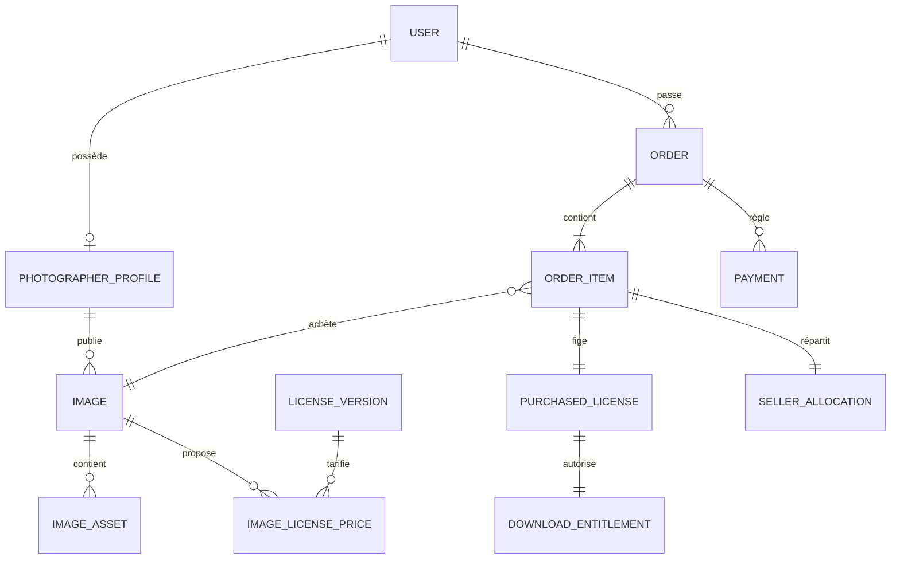

# Phase 0 — cadrage produit et architecture

## A. Périmètre MVP

Le MVP couvre un parcours complet : profil photographe, import d’une image, métadonnées, licence, prix et publication ; découverte, choix d’une licence, paiement, licence immuable et téléchargement autorisé ; audit de la transaction et de la commission. IA, tirages, abonnements, galeries événementielles privées et multi-devises actives restent hors MVP.

## B. Architecture système

Monolithe modulaire Next.js/TypeScript. Les modules métier sont `auth`, `catalog`, `images`, `licenses`, `cart`, `orders`, `payments`, `downloads`, `payouts`, `moderation` et `admin`. Les règles sensibles restent côté serveur. PostgreSQL est la source relationnelle, le stockage objet S3-compatible conserve originaux privés et variantes, Stripe Connect traite les paiements marketplace, et une abstraction de tâches orchestre le traitement d’images.

## C–D. Modèle de domaine et ERD

Tous les montants sont en unité monétaire mineure. Lignes de commande, allocations, paiements et licences achetées sont des instantanés immuables. Les originaux ne sont jamais publics.

## E. Permissions

| Action | Visiteur | Client | Photographe | Modérateur | Admin |
|---|---:|---:|---:|---:|---:|
| Explorer | ✓ | ✓ | ✓ | ✓ | ✓ |
| Acheter/télécharger ses achats | — | ✓ | ✓ | ✓ | ✓ |
| Gérer ses images et revenus | — | — | ✓ | — | ✓ |
| Traiter les signalements | — | — | — | ✓ | ✓ |
| Commission et rôles | — | — | — | — | ✓ |

Chaque permission est contrôlée côté serveur ; l’interface ne constitue jamais une autorisation.

## F. Images

Upload vers stockage privé avec clé contrôlée, puis validation de signature, type, dimensions, taille, quota et propriétaire. Un job extrait les métadonnées, retire le GPS public, génère miniatures WebP, aperçu protégé et filigrane, puis passe l’image de `PROCESSING` à `READY`. La publication est une transition distincte. Une erreur conserve un diagnostic interne et autorise un nouvel essai sûr.

## G. Achat, paiement et reversement

Le serveur recalcule le panier, crée commande et allocations, puis initie le paiement. Seul un webhook signé et idempotent peut confirmer le paiement. Une transaction crée licences achetées, droits de téléchargement et écritures financières. Les remboursements sont bornés par ligne. Stripe Connect effectue les reversements selon la politique configurée ; l’historique conserve brut, taxe, frais, commission et net.

## H. Licences

`LicenseTemplate` porte l’identité logique, `LicenseVersion` les termes versionnés à valider juridiquement, `ImageLicensePrice` une version et son prix, et `PurchasedLicense` copie les termes, version, prix et parties à l’achat. Une modification future ne change jamais un achat passé.

## I. Routes MVP

Public : `/`, `/explorer`, `/photo/[slug]`, `/photographes/[username]`, `/collections/[slug]`, `/licences`. Compte : `/compte/achats`, `/compte/licences`, `/compte/factures`. Studio : `/studio`, `/studio/photos`, `/studio/ventes`, `/studio/revenus`. Administration : `/admin`, `/admin/photos`, `/admin/commandes`, `/admin/signalements`, `/admin/audit`.

## J. Structure

`app/` routes, `modules/` domaines et services, `db/` schéma et migrations, `components/` interface, `lib/` adaptateurs, `jobs/` traitements, `tests/` scénarios critiques et `docs/` décisions.

## K. Menaces

Accès aux originaux, falsification de prix, webhook rejoué, upload malveillant, escalade de rôle, fuite EXIF/GPS, IDOR, XSS, CSRF et sur-remboursement. Défenses prioritaires : stockage privé, URL signée courte, validation par contenu, RBAC serveur, transactions, idempotence, audit, rate limiting, CSP, cookies sécurisés, secrets hors code et tests négatifs.

## L. Feuille de route

1. Fondation : identité, schéma, authentification, RBAC et environnement local.
2. Photographe : onboarding, profil et studio.
3. Images : upload privé, dérivés et publication.
4. Marketplace : exploration, recherche, fiches, collections et favoris.
5. Commerce : licences, panier, Stripe test, webhooks et commissions.
6. Livraison : bibliothèque, factures et téléchargements.
7. Administration : modération, audit et paramètres.
8. Durcissement : sécurité, accessibilité, performance, RGPD et E2E.

## État actuel

- **Implémenté** : accueil responsive, recherche de démonstration, favoris en session, fiche image, sélection de licence et studio de démonstration.
- **Mocké** : catalogue, statistiques, ventes, licences et panier.
- **À faire** : comptes, schéma complet, uploads, traitements, Stripe, webhooks, téléchargements, factures, RBAC et administration.
- **Futur** : IA, recherche visuelle, événements privés, tirages et abonnements.
